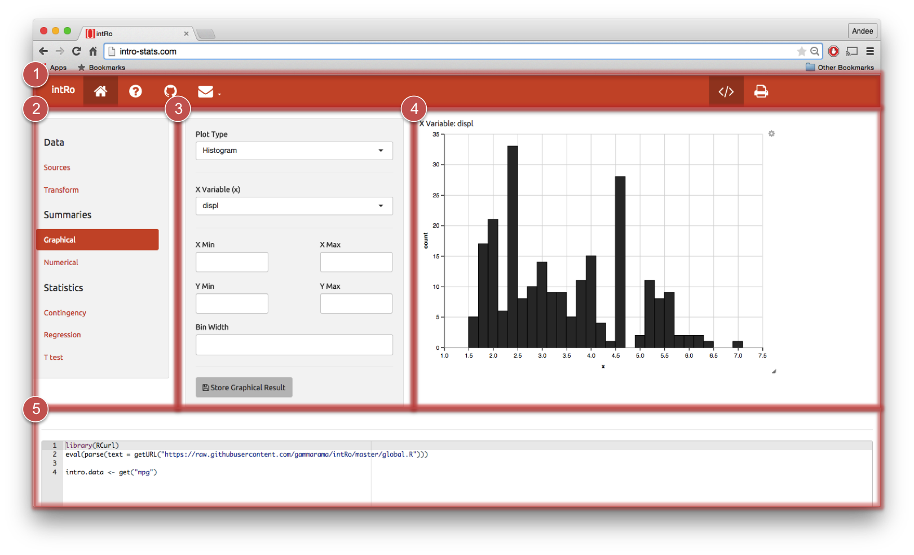

# Introduction

## Do we really need another statistical software package?
Short answer: **yes**

 - `R` is great, but requires students to have some knowledge/interest in programming
 - `JMP` is powerful, but too big
      - Licenses and inconsistent UI
 - New tools recently released to spark an interest in `R`
      - `Swirl` and DataCamp teach `R` programming
      - Project MOSAIC facilitates learning, but assumes knowledge of `R`
 - Want students to focus on data analysis rather than fight with software

## What is `intRo`?
 - A simple **web-based** application for performing basic data analysis and statistical routines
 - Built using `R` and `Shiny`
 - Extensible modular structure
 - Designed for a first statistics class student
 - Assists in the learning of statistics rather than acting as a stand-alone deliverer of statistics education

## Easy
 - Focused on aspects of the user interface (UI) and output that make it easy to pick up without training
 - Minimal necessary functionality for an introductory statistics course
 - Organized around specific tasks a student may perform in the process of a data analysis

</img>

## Exciting
 - Fun, easy to use (available on the web)
 - Interactive plots using `ggvis`
 
**Ulterior motive**: get students excited about programming

 - By navigating about the user interface of `intRo`, students are creating a fully-executable `R` script that they can download and run locally
 - Viewing their script change real-time within the application
 
## Extensible
 - User interaction with `intRo` is split into bitesize chunks that we call *modules*
 - Each module is a self contained set of `R` code that is dynamically added to the application at run time
 - `intRo` can be easily extended by the addition of modules within the frame-work underlying the application
 - Allows instructors/collaborators to tailor `intRo` to the needs of a particular course

# Classroom

## `intRo` in the wild
 - `intRo` was used last semester at Iowa State University in STAT 201
      - Homework assignments and labs used `intRo` to emphasize class concepts
 - `intRo` is a supplement, not the focus of the class 

## Homework 1
 - *Data*: OECD PISA Results in Focus report to assess the workforce readiness of 15-year old students
 - *Goal*: Explore graphically and numerically how the students perceive academics and math
 - `intRo` *Tasks*:
      1. Make a barchart of the variable Enjoy.Maths.
      1. Make a summary of the Enjoy.Maths variable. What proportion of these students agree or strongly agree with the statement "I enjoy mathematics"?
      2. Obtain a contingency table and mosaic plot of the relationship between Country and Enjoy.Maths. Print contingency tables with the **Count** and **Column Proportion** values. 
 
# Live Demo

# Design decisions

## Consistent UI
Elements of `intRo`: 1) top navigation, 2) side navigation, 3) options
panel, 4) results panel, and 5) code panel.

</img>

## Modularity
</img>

# Future work

## What's next?
 - Module creation package
 - Server load
 - Use in other classes

## Module creation package
*Modularity* is a key feature of `intRo`, but module creation is currently:
 
 - Undocumented
 - Entirely manual
 - Unnecessarily lengthy

**Idea**: R package (with associated Shiny app?) to automate creation of `intRo` modules

## Server load
Limited testing has been done to assess how `intRo` handles heavy user load
 
 - Dozens of students accessing app at once
 - Simultaneous larger computations like printing results

More server resources may need to be devoted to handle this, particularly if `intRo` is more widely adopted

## More classes
 - We would like work with instructors to get `intRo` into more classes
 - Module creation package will allow it to suit more curricula
 - We welcome collaborators interested in extending `intRo` to submit pull requests on GitHub (http://www.github.com/gammarama/intRo)
     - Additional modules
     - Improvements and bug fixes

## Special thanks
Dr. Cook, for guiding many of the features and interface decisions, and helping test the functionality in preparation for STAT 201

# Any questions? | Thank you!

Contact: 
ajkaplan@iastate.edu 
erichare@iastate.edu
