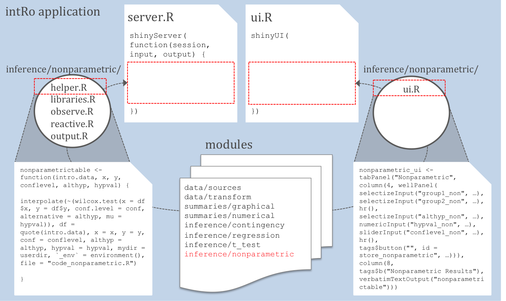

# Introduction

## Do we really need another statistical software package?
Short answer: **yes**

 - `R` is great, but requires students to have some knowledge/interest in programming
 - `JMP`, `Deducer`, `Rcmdr` are powerful, but too big
      - Licenses and installation
 - New tools recently released to spark an interest in `R`
      - `Swirl` and DataCamp teach `R` programming
      - Project MOSAIC facilitates learning, but assumes knowledge of `R`
 - Want students to focus on data analysis rather than fight with software

## What is `intRo`?
 - A simple **web-based** application for performing basic data analysis and statistical routines and accompanying utility package
 - Built using `R` and `Shiny`
 - Extensible modular structure
 - Designed for a first statistics class student
 - Assists in the learning of statistics rather than acting as a stand-alone deliverer of statistics education

## Easy
 - Focused on aspects of the user interface (UI) and output that make it easy to pick up without training
 - Minimal necessary functionality for an introductory statistics course
 - Organized around specific tasks a student may perform in the process of a data analysis

</img>

## Exciting
 - Fun, easy to use (available on the web)
 - Interactive plots using `ggvis`
 
**Ulterior motive**: get students excited about programming

 - By navigating about the user interface of `intRo`, students are creating a fully-executable `R` script that they can download and run locally
 - Viewing their script change real-time within the application
 
## Extensible
 - User interaction with `intRo` is split into bitesize chunks that we call *modules*
 - Each module is a self contained set of `R` code that is dynamically added to the application at run time
 - `intRo` can be easily extended by the addition of modules within the frame-work underlying the application
 - Allows instructors/collaborators to tailor `intRo` to the needs of a particular course

# Take a look | http://intro-stats.com

# Deploying intRo

## intRo package

 - Installation: 
    ```{r eval=FALSE}
    devtools::install_github("rstudio/shinyapps") 
    devtools::install_github("gammarama/intRo")`
    ```
    
 - Functions:
    - `download_intRo` - Downloads a current revision of intRo to your machine
    - `run_intRo` - Runs an intRo session locally with the specified options
    - `deploy_intRo` - Deploys an instance of intRo to ShinyApps.io with the specified options

# Design decisions

## Consistent UI
Elements of `intRo`: 1) top navigation, 2) side navigation, 3) options
panel, 4) results panel, and 5) code panel.

</img>

## Consistent UI (Cont'd)
 - Large, easy to click icons in the page header to help students find
exactly what they need easily
 - Each module maintains a consistent layout, helping the user to become familiar with the location of the options, the results, and the code
 - Documentation website that is consistent with
the interface of the application; covers all default modules and makes learning to use `intRo` even more painless

## Modularity
</img>

## Modularity (Cont'd)
The interface is created with the following statement

```{r, tidy=FALSE, eval=FALSE}
## Source ui
module_info <- read.table("modules/modules.txt", header = TRUE, 
                          sep=",")
sapply(file.path("modules", dir("modules")[dir("modules") 
                      != "modules.txt"], "ui.R"), source)
## Create the UI
shinyUI(navbarPage("intRo", theme = "bootstrap.min.css",
               tabPanel(title="", icon=icon("home"),
                        fluidRow(
                        ### <b>
                          do.call(navlistPanel, 
                              c(list(id = "side-nav", 
                              widths = c(2, 10)), mylist))
                        ### </b>
                        )
               ), ...
))
```

## Modularity (Cont'd)
The server functions are dynamically generated using a similar method

```{r, eval=FALSE, tidy=FALSE}
shinyServer(function(input, output, session) {
  ## Module info
  module_info <- read.table("modules/modules.txt", 
                            header = TRUE, sep=",")
  ## Modules
  types <- c("helper.R", "static.R", "observe.R", 
             "reactive.R", "output.R")
  modules_tosource <- file.path("modules", 
                                apply(expand.grid(
                                module_info$module, types)
                                , 1, paste, collapse = "/"))
  ## Source the modules
  for (mod in modules_tosource) {
    ### <b>
    source(mod, local = TRUE) 
    ### </b>
  }
})
```

# Challenges

## Tradeoffs
We encountered a number of challenges in striving to strike the balance of functionality and ease-of-use:

 - Presenting only relevant options to the user
 - Producing clean and executable R code

## Presenting choices
 - `intRo` is flexible, but must also be simple for the introductory student
 - Despite increasing the complexity of the code, we decided to only show options appropriate for the given selections.

**Example**:


## Producing clean code
Code generated must be:

 - Executable on the server
 - Executable on the user's machine
 - Clean

## Producing clean code (Cont'd)

 - Each call is wrapped in a function called `interpolate`
    - Executes the given R code on the server
    - Writes the code executed to the script window at the bottom of intRo

```{r, eval=FALSE}
nonparametric_test <- function(intro.data, x, y, ...) {
  ### <b>
  interpolate(~(wilcox.test(x = df$x, 
  ### </b>
                            y = df$y, ...),
                  df = quote(intro.data),
                  x = x,
                  y = y,
                  ...,  
                  `_env` = environment(), 
                  file = "code_nonparametric.R")
}
```

# Future work

## Module creation
*Modularity* is a key feature of `intRo`, but module creation is currently:
 
 - Undocumented
 - Entirely manual
 - Unnecessarily lengthy

**Idea**: Include funcitonality in current R package to automate creation of `intRo` modules

## More classes
 - We would like work with instructors to get `intRo` into more classes
 - Module creation package will allow it to suit more curricula
 - We welcome collaborators interested in extending `intRo` to submit pull requests on GitHub (http://www.github.com/gammarama/intRo)
     - Additional modules
     - Improvements and bug fixes

# Any questions? | Thank you!

Contact:<br/>
ajkaplan@iastate.edu<br/>
erichare@iastate.edu


